# Plan: Modern Industry-Standard Expo Android App for Daily Amar Desh (দৈনিক আমার দেশ)

## 1. Goal Description

Transform the existing Expo React Native mobile application (`AmarDeshApp`) into a premier, industry-standard Android news app that authentically mirrors the editorial depth, content taxonomy, and brand authority of [dailyamardesh.com](https://www.dailyamardesh.com/), while delivering an exceptional native mobile experience tailored for readers across Bangladesh and the global diaspora.

---

## 2. Understanding Daily Amar Desh & Target Audience

### 2.1 Publication Identity & Brand Heritage
- **Title & Motto**: দৈনিক আমার দেশ (*Daily Amar Desh*) — *"স্বাধীনতার কথা বলে"* (Speaks of Independence).
- **Editor & Publisher**: মাহমুদুর রহমান (Mahmudur Rahman).
- **Stance & Editorial Focus**: Independent, pro-democratic, sovereignty-oriented, investigative journalism, comprehensive coverage of the historic July 2024 Mass Uprising, in-depth political commentary, economic scrutiny, and Islamic values.
- **Target Readership**:
  - Domestic readers spanning all 8 divisions and 64 districts in Bangladesh.
  - Global Bangladeshi expatriates (Middle East, UK, US, Canada, Malaysia, etc.) seeking unfiltered national news.
  - Readers often on variable mobile network connectivity (2G/3G/4G/5G).

### 2.2 Live Content Taxonomy on `dailyamardesh.com`
From live site inspection, the portal publishes across these core verticals:
1. **সর্বশেষ (Latest / Breaking)**: Real-time chronologic news stream with relative timestamps (e.g. *১৫ মিনিট আগে*).
2. **ইপেপার (ePaper — `eamardesh.com`)**: Digital edition of the printed newspaper with page navigation.
3. **জুলাই বিপ্লব (July Revolution)**: Flagship dedicated vertical documenting the 2024 uprising, martyr profiles, special investigative reports, and state reforms.
4. **জাতীয় (National)**: Capital governance, administration, executive and judicial reporting.
5. **রাজনীতি (Politics)**: Political parties (BNP, Jamaat, NCP, AB Party, Islami Andolan, student politics).
6. **বাণিজ্য ও কর্পোরেট (Business, Economy & Corporate)**: Inflation, bank reforms, remittance, market prices, corporate CSR.
7. **সারা দেশ (Countrywide / Hyperlocal News)**: 8 administrative divisions (ঢাকা, চট্টগ্রাম, রাজশাহী, খুলনা, বরিশাল, সিলেট, রংপুর, ময়মনসিংহ) and district-level reporting.
8. **বিনোদন (Entertainment)**: Cinema, television, culture, music, OTT.
9. **বিশ্ব (World / International)**: Global geopolitics, Muslim world, Middle East, US/Europe.
10. **খেলা (Sports)**: Cricket (BCB/Tigers, BPL), Football (national & international leagues), tennis, athletics.
11. **ইসলাম ও জীবন (Islam & Life)**: Daily religious guidance, Quran/Hadith reflections, prayer insights.
12. **ফিচার ও জীবনধারা (Features & Lifestyle)**: Health, science, tech, career, education.
13. **উপ-সম্পাদকীয় ও মতামত (Op-Ed & Editorials)**: Flagship columns by Mahmudur Rahman and guest columnists.
14. **ভিডিও ও মাল্টিমিডিয়া (Video & Multimedia)**: Video reports, live broadcasts, YouTube integrations.
15. **শিক্ষা ও ক্যাম্পাস (Education)**: University exams, BCS, campus news.

---

## 3. Comprehensive Audit: What Exists vs. What is Missing

| Dimension | What Currently Exists in Codebase | What is Missing / Deficient vs. Live Site | Modern Industry Standard Target |
| :--- | :--- | :--- | :--- |
| **Content Ingestion** | Single flat RSS parser (`/feed`) fetching ~20 recent items only. | Category filtering yields empty lists because RSS only has top 20 items. No division news, no sub-categories, no archive. | Multi-category fetcher, live scraper engine, and pagination capable of populating all 14 site categories. |
| **Article Reading** | Detail screen displays only truncated 150-word excerpt from RSS. | Full article body text, paragraph styling, photo captions, author avatar, and related stories are missing. | Full-text article extractor with rich formatting, pull quotes, image captions, and related article recommendations. |
| **Bengali Typography** | System default fallback fonts (inconsistent on MIUI, OneUI, Vivo, Transsion). | Custom fonts (`AmarDesh_Bold`, `AmarDesh_Regular`, `NotoSerifBengali`) used on web are missing in app. | Embedded Bengali fonts (`AmarDesh` / `Noto Serif Bengali`), font scaling (A- / A+), and consistent Bengali numerals (`১২৩৪৫৬৭৮৯০`). |
| **ePaper Integration** | Completely missing. | The print replica (`eamardesh.com`) is a primary header item on the web. | **Native Image Gallery Edition**: High-res daily page scan viewer (১ম পাতা, শেষ পাতা, সম্পাদকীয় পাতা) with pinch-to-zoom and offline download. |
| **July Revolution Hub** | Completely missing. | Dedicated top-tier navigation category on `dailyamardesh.com`. | Dedicated themed hub with martyr archive, documentary reports, and badge filters. |
| **Division / District News** | Hardcoded category string without location hierarchy. | The live site organizes rural/district news into 8 divisions. | Hyperlocal district selector (বিভাগ ও জেলা নির্বাচন) for personalized regional news. |
| **Video & Multimedia** | Unused `YouTubePlayer.tsx` component; no video feed. | Video cards with red play icons are prominent across homepage. | Video hub screen with inline preview playback, full-screen player, and YouTube playlist sync. |
| **Islam & Life (ইসলাম ও জীবন)** | Only a static category name. | No Islamic daily utility for Bangladeshi readers. | Daily Namaz (prayer) timetable widget based on user's district, Hijri calendar date, and Quran/Hadith daily card. |
| **Audio / TTS News** | Basic `expo-speech` call stopped on unmount. | Cannot listen to news in background or while browsing other headlines. | Floating mini-audio player bar with play/pause, scrub, 0.8x-1.5x speed control, and Bengali voice detection. |
| **Offline & Low Data Mode** | Basic AsyncStorage key caching. | No one-tap "Download Today's Edition", no image data-saver toggle for 2G/3G networks. | "আজকের পত্রিকা ডাউনলোড" offline sync pack with cached images + low-data text mode. |
| **Android Native UX** | Basic tab navigation. | No breaking news flash ticker, no collapsible header, no Material 3 dynamic color styling. | **5-Tab Navigation** (হোম, ইপেপার, ভিডিও, সেভ, মেনু), edge-to-edge layout, animated breaking news marquee, smooth pull-to-refresh, haptic feedback, and Android 13+ notification channels. |

---

## 4. Architecture & Data Flow

```mermaid
graph TD
    subgraph Data Sources
        WebSite[dailyamardesh.com Web & Next.js Endpoints]
        RSS[dailyamardesh.com/feed]
        EPaperScans[eamardesh.com Daily Page Scans]
        YouTube[Amar Desh YouTube Channel]
    end

    subgraph Core Services Layer
        IngestionService[Unified Content Service]
        Scraper[Full Article Body Extractor & HTML Parser]
        EPaperService[ePaper Page Cache & Download Manager]
        OfflineSync[Offline SQLite & Image Cache Manager]
        TTSEngine[Bengali Text-to-Speech Engine]
        PrayerEngine[District Prayer Times Engine]
        NotifService[Android Notification Channel Manager]
    end

    subgraph State & Personalization
        ArticleStore[Zustand Article Store - Multi-Category]
        UserStore[User Engagements, Affinities & Reading Streaks]
        SettingsStore[App Settings, Font Size, Low-Data, Theme]
    end

    subgraph Mobile UI Screens
        Home[HomeScreen: Ticker, Categories, Hero, Division Spotlight]
        EPaperScreen[EPaperScreen: Native Page Gallery with Pinch-Zoom]
        VideoScreen[VideoScreen: Video Hub with Player & Feeds]
        BookmarksScreen[BookmarksScreen: Saved Stories & Offline Editions]
        MenuScreen[MenuScreen: Full 14-Category Drawer & Settings]
        CategoryFeed[CategoryScreen: Sub-categories & Infinite Scroll]
        ArticleDetail[ArticleDetailScreen: Full Body, Audio Bar, Font Adjuster]
        JulyRevScreen[July Revolution Special Memorial Portal]
        DistrictModal[District & Division Hyperlocal Selector]
    end

    WebSite --> IngestionService
    RSS --> IngestionService
    WebSite --> Scraper
    EPaperScans --> EPaperService
    YouTube --> VideoScreen

    IngestionService --> ArticleStore
    Scraper --> ArticleStore
    EPaperService --> EPaperScreen
    ArticleStore --> OfflineSync

    ArticleStore --> Home
    ArticleStore --> CategoryFeed
    ArticleStore --> ArticleDetail
    PrayerEngine --> Home
    TTSEngine --> ArticleDetail

    UserStore --> Home
    SettingsStore --> ArticleDetail
```



---

## 5. Architectural Alignment & Decisions Made

> [!IMPORTANT]
> **User Selected Design Choices**:
> 1. **ePaper Viewer (ইপেপার)**: Implemented as a **Native Static Image Gallery Edition** downloaded daily. Allows readers to browse pages (১ম পাতা, শেষ পাতা, সম্পাদকীয়, সারা দেশ, আন্তর্জাতিক, বাণিজ্য, খেলা), pinch-to-zoom to read columns, and save the edition for offline reading without needing internet.
> 2. **Bottom Tab Navigation**: Implemented as **5-Tab Navigation**:
>    - **হোম (Home)**: Top news, breaking ticker, category chips, division carousel, op-ed.
>    - **ইপেপার (ePaper)**: Daily print edition page gallery reader.
>    - **ভিডিও (Video)**: Amar Desh video news and multimedia clips.
>    - **সেভ (Saved)**: Bookmarked articles and downloaded offline editions.
>    - **মেনু (Menu)**: Full directory of all 14 site categories (July Revolution, সারা দেশ, ইসলাম ও জীবন, ইত্যাদি) + Settings + Search.

---

## 6. Implementation Roadmap & Milestones

### Phase 1: Core Navigation & 5-Tab Restructure
- Modify [app/(tabs)/_layout.tsx](file:///d:/Repo/AmarDeshApp/app/%28tabs%29/_layout.tsx) to establish the 5 core tabs: `index` (হোম), `epaper` (ইপেপার), `video` (ভিডিও), `bookmarks` (সেভ), `menu` (মেনু).
- Create `app/(tabs)/epaper.tsx`: Native daily page-flip viewer with page switcher (১ম পাতা, ২য় পাতা, etc.), pinch-to-zoom via `react-native-gesture-handler` / `expo-image`, and "আজকের পত্রিকা ডাউনলোড" offline download button.
- Create `app/(tabs)/video.tsx`: Multimedia video feed with video cards and inline YouTube playback.
- Create `app/(tabs)/menu.tsx`: Comprehensive menu displaying all 14 categories from `dailyamardesh.com`, district selector, prayer times, and settings.

### Phase 2: Multi-Category Ingestion & Full-Text Article Extractor
- Implement `services/contentService.ts` to ingest stories across all 14 verticals with pagination and category indexing.
- Implement `services/articleScraper.ts`: Live extractor to parse full article paragraphs, image captions, author avatars, and related stories when any article is opened.
- Persist full articles into SQLite (`user/db.ts`) for instant instant offline reload.

### Phase 3: Homepage Redesign (Reflecting `dailyamardesh.com`)
- Add **Live Bengali Date Banner**: e.g., *"বুধবার, ০৭ অক্টোবর ২০২৬"*.
- Add **Breaking News Ticker (ব্রেকিং নিউজ)**: Animated red pulse marquee with live urgent updates.
- Add **Category Chips Bar**: Full horizontal scroll featuring all categories: `সর্বশেষ`, `জুলাই বিপ্লব`, `জাতীয়`, `রাজনীতি`, `বাণিজ্য`, `সারা দেশ`, `বিনোদন`, `বিশ্ব`, `খেলা`, `ইসলাম ও জীবন`, `ফিচার`, `মতামত`.
- Add **Lead Hero Article** & **Dual-column grid layout**.
- Add **July Revolution spotlight card** and **Division-wise news carousel** with quick division switcher.

### Phase 4: Full Article Reader & Audio TTS Bar
- Modify [app/article/[id].tsx](file:///d:/Repo/AmarDeshApp/app/article/%5Bid%5D.tsx):
  - Reader typography bar (A- / A+ font size slider, line spacing).
  - Floating mini-player for Bengali Text-to-Speech (`expo-speech`) with Play/Pause, Rewind 10s, and Speed controls (1.0x, 1.25x, 1.5x) that keeps playing as the user navigates.
  - Pull quotes, image captions, author avatar, and related stories carousel.
  - Branded Bengali share cards (WhatsApp, Facebook, system share).

### Phase 5: Hyperlocal Division News, July Revolution Hub & Prayer Times
- Create `components/DistrictPickerModal.tsx` for selecting 8 divisions & 64 districts in Bangladesh.
- Create `app/july-revolution/index.tsx` for the dedicated July Revolution memorial hub.
- Create `components/PrayerTimesWidget.tsx` and `services/prayerTimesService.ts` for district-accurate Namaz timetable and Hijri date.

### Phase 6: Android System Polish & Verification
- Notification channel configuration in [services/notificationService.ts](file:///d:/Repo/AmarDeshApp/services/notificationService.ts) for Android 13+.
- Type check verification (`npm run typecheck`).
- Jest test suite execution (`npm test`).

---

## 7. Verification Plan

### Automated Tests
- Run TypeScript strict verification:
  ```bash
  npm run typecheck
  ```
- Run unit test suite:
  ```bash
  npm test
  ```

### Manual Verification
1. **5-Tab Navigation**: Verify seamless switching between Home, ePaper, Video, Saved, and Menu tabs.
2. **ePaper Reader**: Open ePaper, swipe between pages, pinch-to-zoom into columns, test download for offline reading.
3. **Full Article Reading**: Verify complete paragraph text, photo captions, author avatar, font sizing (A-/A+), and related news.
4. **TTS Audio Bar**: Start listening to an article, verify audio persists across screens with mini-player controls.
5. **District & Division Selector**: Switch division to Chattogram/Sylhet/Rajshahi and verify localized news updates.
6. **Breaking Ticker**: Verify smooth animation and click-through to breaking stories.
