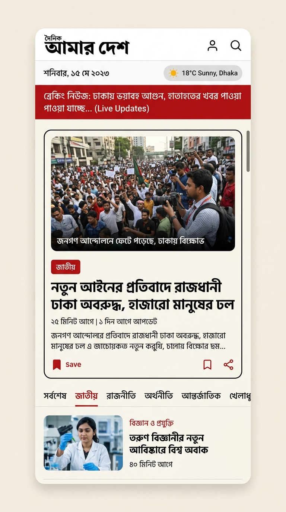
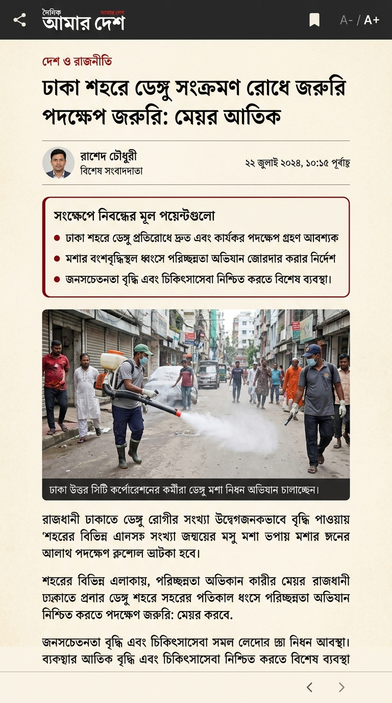
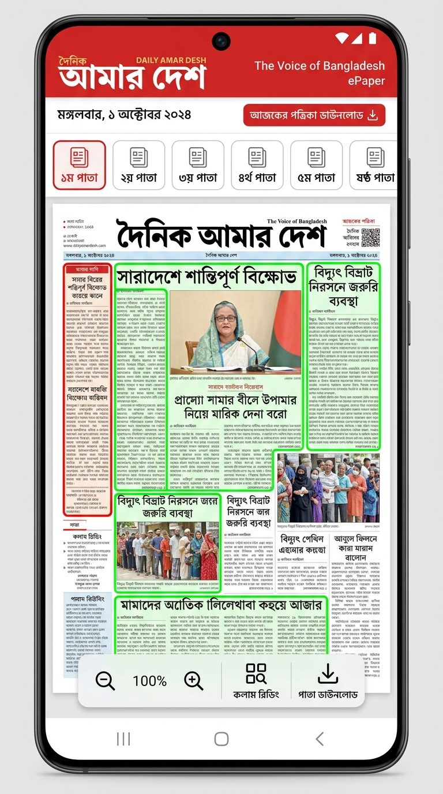
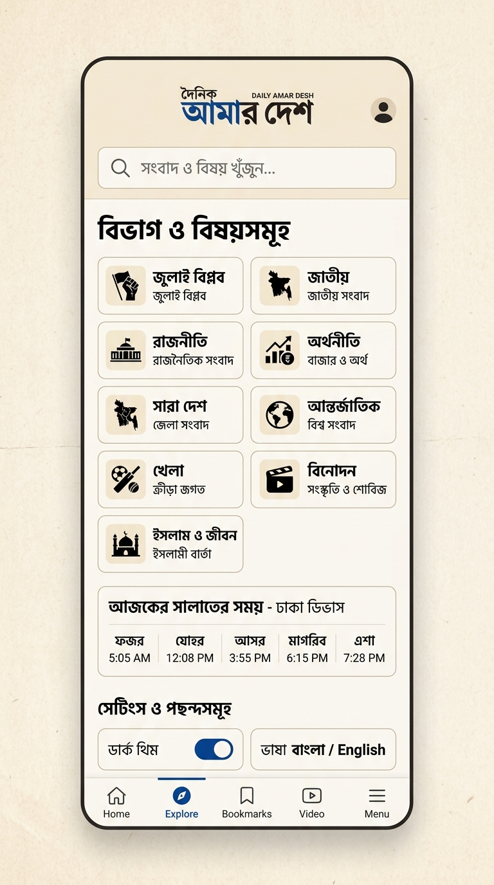

# PROJECT PROPOSAL: OFFICIAL MOBILE APPLICATION ECOSYSTEM
## FOR DAILY AMAR DESH (দৈনিক আমার দেশ)

**Document Reference:** CC-PRP-2026-AMARDESH-01  
**Target Recipient:**  
Amar Desh Publication Limited (আমার দেশ পাবলিকেশন লিমিটেড)  
Dhaka Trade Centre (8th Floor), 99 Kazi Nazrul Islam Avenue, Karwan Bazar, Dhaka-1215  
**Attn:** Mr. Mahmudur Rahman (Editor & Publisher) & Editorial / IT Directorate  
**Prepared By:** CybrCraft (https://cybrcraft.com/)  
**Date:** October 2026  
**Document Classification:** Commercial in Confidence  

---

## 1. Executive Summary

Daily Amar Desh (*দৈনিক আমার দেশ*), founded under the motto **"স্বাধীনতার কথা বলে"** (Speaks of Independence) and led by respected Editor and Publisher Mahmudur Rahman, represents one of Bangladesh’s most resilient, principled, and influential media institutions. Following the historic July 2024 uprising and the revival of the publication, millions of readers across Bangladesh and the global diaspora have turned to *Amar Desh* for bold, uncompromising, and truthful journalism.

While the newspaper has successfully launched its modern web portal (*dailyamardesh.com*) and digital e-paper (*eamardesh.com*), **Daily Amar Desh currently lacks an official, flagship native mobile application on the Google Play Store and Apple App Store.**

In today's digital landscape:
- **Over 92% of digital news in Bangladesh is accessed via mobile smartphones.**
- Readers demand **instant push notifications** the second major national news breaks.
- Readers expect an optimized **ePaper reading experience** that feels as crisp and tactile as physical paper.
- Readers demand **offline access** to read analysis and editorials even during travel, rural internet drops, and power disruptions.

### Two-Phase Strategic Approach:
To deliver maximum certainty and minimize administrative friction, CybrCraft approaches this engagement in two distinct phases:

1. **Phase 1 (Live Demo & Proof-of-Concept — Ready Today):**  
   CybrCraft has already engineered a fully functioning, high-fidelity Android demo application that mirrors *dailyamardesh.com*’s live taxonomy, visual branding, e-paper editions, and July Revolution portal. This allows Mr. Mahmudur Rahman and the senior editorial/IT board to test and evaluate the user experience directly on their personal smartphones before formal sign-off.
2. **Phase 2 (Official Production Backend Integration — Post-Confirmation):**  
   Upon formal project confirmation, the production application **will not rely on client-side scraping**. Instead, it will be **seamlessly and securely integrated directly with Daily Amar Desh’s official web backend and CMS via authenticated REST/GraphQL APIs and webhooks**.

### Zero Extra Work for the Amar Desh Newsroom (One-Stop Automated Solution):
The editorial team, journalists, and newsroom staff **will NOT have to perform any manual tasks or duplicate data entry**. Editors will publish articles, multimedia, and daily e-papers in their usual CMS exactly as they do today. The mobile application ecosystem will automatically, securely, and instantaneously ingest published content and broadcast breaking news push notifications.

Furthermore, if any **backend stack modernization or API optimization** is required on the server side, CybrCraft’s engineering team will assess and implement it as part of our integration scope.

---

## 2. Business Challenge & Strategic Opportunity

### 2.1 The Current Gaps
| Current Challenge | Impact on Amar Desh | The CybrCraft Solution |
| :--- | :--- | :--- |
| **No Push Notifications** | Readers learn about breaking news from third-party social media or rival dailies before visiting the website. | Native FCM & Expo Push notifications capable of delivering breaking news to 1,000,000+ devices in seconds. |
| **Mobile Browser Friction** | Accessing news via Chrome/Safari requires typing URLs or search queries; retention drops by 65%. | Permanent branded icon on the user's home screen; single-tap access with near-instant cold launch (<1.2s). |
| **Connectivity Dependencies** | In rural Bangladesh or during network outages, web browsers display "No Internet Connection." | Embedded SQLite database caches articles and images for 7 days; full offline reading and search. |
| **Clunky ePaper on Mobile** | Web-based PDF readers on mobile browsers suffer from slow panning and pinch-to-zoom lag. | Native image-based ePaper viewer with smooth page flips (১ম থেকে ৮ম পাতা) and offline edition saving. |
| **Trademark Exploitation** | Unofficial scraper apps emerge on Google Play, serving unauthorized ads and harming brand reputation. | An official, verified Google Play Store and Apple App Store presence certified by Amar Desh Publication Ltd. |

### 2.2 Strategic Value to Amar Desh
1. **Total Audience Ownership:** Direct relationship with readers independent of unpredictable third-party social media algorithms (Facebook/X/Google algorithms).
2. **Honoring the 2024 Movement:** Dedicated interactive memorial vertical for the **July Revolution (জুলাই বিপ্লব)**, preserving archives, martyrs' chronicles, and historic reforms.
3. **Hyperlocal Engagement:** Division selector covering Dhaka, Chittagong, Rajshahi, Khulna, Barisal, Sylhet, Rangpur, and Mymensingh, driving localized reader engagement.
4. **Reader Accessibility:** Bengali Text-to-Speech (অডিও সংবাদ) for commuters, busy professionals, and visually impaired readers; customizable font sizing (A- / A+).

---

## 3. System Architecture & Technical Implementation

```
┌────────────────────────────────────────────────────────────────────────┐
│                   DAILY AMAR DESH MOBILE APPLICATION                   │
└────────────────────────────────────┬───────────────────────────────────┘
                                     │
       ┌─────────────────────────────┼─────────────────────────────┐
       ▼                             ▼                             ▼
┌──────────────┐              ┌──────────────┐              ┌──────────────┐
│  PRESENTATION│              │  APPLICATION │              │ DATA & CACHE │
│    LAYER     │              │    LAYER     │              │    LAYER     │
├──────────────┤              ├──────────────┤              ├──────────────┤
│• Expo Router │              │• Secure REST │              │• expo-sqlite │
│• NativeTabs  │              │  API Layer   │              │  (Full Text) │
│• Pinch-Zoom  │              │• Audio TTS   │              │• Async       │
│• Dark / Light│              │• Prayer Time │              │  Storage     │
│• Custom Font │              │• Push Poller │              │• expo-image  │
│  (AmarDesh)  │              │  (FCM/Expo)  │              │  Disk Cache  │
└──────────────┘              └──────────────┘              └──────────────┘
       ▲                             ▲                             ▲
       └─────────────────────────────┼─────────────────────────────┘
                                     │ (Token-Authenticated REST API / Webhooks)
                                     ▼
                     ┌───────────────────────────────┐
                     │ AMAR DESH OFFICIAL CMS/BACKEND│
                     ├───────────────────────────────┤
                     │• Existing Web CMS & Database  │
                     │  (Zero Extra Work for Editors)│
                     │• https://eamardesh.com Scans  │
                     │• Verified Amar Desh YouTube   │
                     │• Optional Backend Stack       │
                     │  Modernization (by CybrCraft) │
                     └───────────────────────────────┘
```

### 3.1 Two-Phase Technical Delivery
1. **Interactive Demo PoC (Current State):**  
   Built and verified using autonomous ingestion so that Amar Desh stakeholders can immediately test features on Android devices without touching their production servers.
2. **Official Backend Integration (Post-Confirmation):**  
   - Direct integration with Amar Desh's primary CMS and API endpoints.
   - Secure token-based authentication preventing unauthorized data scraping by competitors.
   - Automated webhook triggers: When an editor clicks "Publish" in the CMS, the article is instantaneously synced to the mobile database and triggers push notifications.
   - **Backend Modernization (if needed):** CybrCraft will review and upgrade backend API layers or caching tiers (e.g. Next.js API optimization, Redis/Cloudflare edge caching) to handle surges of millions of mobile users during national events.

### 3.2 Five Core Navigation Hubs
1. **হোম (Home Feed):**
   - Live Bengali Date Header (`বুধবার, ০৭ অক্টোবর ২০২৬`) with Gregorian and Hijri calendar integration.
   - Real-time animated **ব্রেকিং নিউজ (Breaking News Ticker)** with urgent flash indicators.
   - Real-time **নামাজের সময়সূচি (Prayer Times Widget)** customized for the reader's division with next-prayer countdown.
   - Dynamic **বিভাগ ফিল্টার (Division Switcher)** for zero-permission hyperlocal regional reporting.
   - Lead Hero Headline with high-resolution image, category pill, and relative Bengali timestamp (`৫ মিনিট আগে`).
   - 14-vertical horizontal carousel chips for instant section jumping.
   - Dedicated **জুলাই বিপ্লব (July Revolution)** featured portal card.
2. **ই-পেপার (ePaper Gallery):**
   - Native daily newspaper edition reader seamlessly linked to *eamardesh.com*.
   - Multi-page navigation (১ম পাতা, ২য় পাতা, ... ৮ম পাতা) with thumbnail rail.
   - Fluid pinch-to-zoom, pan, and double-tap magnification powered by `expo-image`.
   - Single-tap download for full offline reading during flights, travels, or outages.
3. **ভিডিও (Multimedia Hub):**
   - Video news hub pulling directly from Amar Desh’s verified YouTube broadcasts and multimedia desk.
   - Inline playback with category tags (জাতীয়, বিশ্লেষণ, সাক্ষাৎকার, বিশেষ প্রতিবেদন).
4. **সেভ (Saved & Offline Hub):**
   - Persistent offline library allowing readers to bookmark articles for later reading.
   - Search within saved articles by title, summary, or category.
   - Storage manager showing cached article count and storage consumption.
5. **মেনু (Catalog & Settings):**
   - Complete directory of all 14 site verticals (সর্বশেষ, জাতীয়, রাজনীতি, সারা দেশ, বাণিজ্য, বিশ্ব, খেলা, বিনোদন, ইসলাম ও জীবন, ফিচার, আমার দেশ পরিবার, ইত্যাদি).
   - Instant full-text search with recent search term memory.
   - In-app Font Size Adjuster (ছোট, স্বাভাবিক, বড়, অত্যন্ত বড়).
   - Dark Mode (ডার্ক মোড) / Light Mode toggle.
   - Direct office contact details and official social links (Facebook, YouTube, X, TikTok, WhatsApp).

---

## 4. UI/UX Design System Showcase & Broadsheet Aesthetics

To honor *Daily Amar Desh*'s historical broadsheet stature and editorial courage, CybrCraft engineered the **"Modern Editorial"** design system using the Stitch UI framework. The interface rejects generic corporate tech styles, embracing authentic broadsheet paper parchment (`#FBF9F5`), printer's ink typography (`#121212`), iconic editorial crimson accents (`#BA131A`), and 1px hairline rules (`#E5E0D8`).

The four high-fidelity screens below showcase the exact user experience crafted for Amar Desh readers:

| **Figure 3: Broadsheet Home Feed** | **Figure 4: Narrative Article Reader** |
| :---: | :---: |
|  |  |
| *Live broadsheet masthead, animated breaking news ticker, lead hero splash, and 14-vertical category carousel chips.* | *Book-grade typography (Newsreader / Noto Serif), 3-point AI smart summary, bracketed author bylines, and audio listen mode.* |

| **Figure 5: Digital ePaper & Saved Edition** | **Figure 6: Sections Directory & Topics Hub** |
| :---: | :---: |
|  |  |
| *High-resolution print replica canvas with 1px column hotspot crop reading, page thumbnail rail, and offline download.* | *Complete 14-vertical newsroom directory, 64-district hyperlocal selector, AI assistant preferences, and bilingual toggles.* |

---

## 5. Scope of Work & Deliverables

CybrCraft will provide an end-to-end, white-glove deployment:

### Deliverable 1: Official Backend Integration & API Modernization
- Collaborative configuration of official REST/GraphQL APIs and webhooks between Amar Desh's CMS and the mobile app.
- Stack modernization support: Assessing server infrastructure and implementing edge caching or API optimizations if required.
- End-to-end automation ensuring newsroom staff perform zero manual mobile tasks.

### Deliverable 2: Native Mobile Applications
- Production-ready Android App (`.aab` release bundle for Google Play Store + standalone `.apk` for direct Amar Desh website distribution).
- iOS App (`.ipa` release bundle for Apple App Store).

### Deliverable 3: Store Listings & Asset Preparation
- Creation of App Store screenshots, feature graphics, and high-definition icons reflecting Amar Desh’s official brand guidelines.
- Writing of bilingual (Bengali & English) Store Descriptions, keywords, and privacy policy documentation.
- Submission to the Google Play Console and Apple App Store under Amar Desh Publication Limited's developer account.

### Deliverable 4: Automated Push Notification System
- Deployment of automated notification triggers linked to the CMS publish event.
- Secure editorial interface or Telegram/WhatsApp trigger interface for the Amar Desh Online Desk to push instant urgent breaking alerts.

### Deliverable 5: Documentation & Knowledge Transfer
- Complete technical handbook and operational manual for Amar Desh’s IT and Online editorial teams.
- Hands-on training session for editorial staff at Amar Desh HQ or via video conference.

---

## 6. Implementation Roadmap (3-Week Rapid Delivery)

Because CybrCraft has already engineered and verified the core frontend and mobile architecture in the Demo PoC, the delivery timeline is compressed from traditional 12-16 weeks down to **3 weeks**:

```
[ Week 1: Alignment, Backend API & Setup ]
 Day 1-2: Kickoff with Amar Desh IT Team; Review CMS architecture & API endpoints.
 Day 3-4: Secure API Token Setup & Developer Accounts (Google Play Console & Apple Developer).
 Day 5  : Push Notification Poller & Webhook Deployment on Amar Desh server or CybrCraft Cloud.

[ Week 2: Internal Editorial Beta Testing & API Audit ]
 Day 6-8: Delivery of Private Beta APK connected to official backend for Mahmudur Rahman & Senior Editors.
 Day 9-10: Incorporating editorial feedback (custom category ordering, prayer calculation adjustments).
 Day 11-12: Final Release Candidate (RC) verification, backend load testing, and security audit.

[ Week 3: Store Submission & Public Launch ]
 Day 13-15: Google Play Store & Apple App Store submission and review tracking.
 Day 16-18: Store Approval and Live Publishing.
 Day 19-21: Official Announcement in Daily Amar Desh print & web editions; monitoring & analytics.
```

---

## 7. Commercial Investment Options

CybrCraft offers flexible engagement models tailored to Amar Desh Publication Limited's operational strategy:

### Option A: Turnkey Ownership & Handover (Recommended)
*One-time development, backend API integration, deployment, and full source code handover.*
- **Scope:** Complete delivery of Android and iOS applications, official backend API integration, store publishing, push notification setup, 3 months of complimentary warranty and bug-fixing.
- **Ownership:** Amar Desh receives 100% intellectual property, full GitHub source code repository, and exclusive publishing rights.
- **Investment:** Contact for Commercial Quote / BDT 3,50,000 (Three Lakh Fifty Thousand Taka only).

### Option B: Turnkey + Annual Managed Partnership
*Turnkey delivery with ongoing continuous maintenance, backend monitoring, updates, and OS compatibility.*
- **Scope:** Everything in Option A + full continuous maintenance:
  - Monthly OS compatibility updates (Android 15/16, iOS 18/19).
  - 24/7 server monitoring of the API and push notification pipeline.
  - Quarterly feature enhancements (e.g., interactive polls, user comments, live election center).
  - Guaranteed 4-hour SLA for critical issue resolution.
- **Investment:** Initial Deployment: BDT 2,50,000 + Monthly Retainer: BDT 25,000/month.

### Option C: Strategic Revenue-Share / Media Partnership
*Zero initial capital expenditure with collaborative monetization.*
- **Scope:** CybrCraft integrates, develops, and maintains the app at zero upfront cost. Monetization is handled jointly through native direct sponsorship ad units managed in collaboration with the Amar Desh Advertisement Department (*বিজ্ঞাপন বিভাগ: +৮৮০-১৩৩২-৮৩৭৫১৪*), with a shared revenue agreement.

*(All commercial pricing is negotiable based on Amar Desh Publication Limited's preferred scope and partnership structure.)*

---

## 8. Service Level Agreement (SLA) & Post-Launch Support

For ongoing maintenance, CybrCraft provides enterprise-grade reliability:

| Service Level | Metric | Guarantee |
| :--- | :--- | :--- |
| **Uptime & API Ingestion Reliability** | Content & Publishing Sync | 99.9% uptime |
| **Critical Incident Response** | App Crash or Feed Breakage | Under 2 Hours response; Fix within 6 Hours |
| **Standard Feature Update** | Editorial / UI adjustments | 48-72 Hours turnaround |
| **OS Compatibility Guarantee** | New Android & iOS major updates | Zero-day compatibility updates |

---

## 9. About CybrCraft

**CybrCraft** (https://cybrcraft.com/) is a premier software development and digital transformation agency based in Dhaka, Bangladesh (*Bashundhara Riverview*). 

### Why CybrCraft is the Ideal Partner:
1. **Proven Track Record:** Over 50+ successfully delivered software and web platforms, serving 30+ enterprise clients across healthcare, e-commerce, LMS, and digital publications.
2. **Deep Local Expertise:** Headquartered in Dhaka, our leadership and engineering teams can visit Amar Desh HQ (*Dhaka Trade Centre, Karwan Bazar*) within hours for in-person collaboration.
3. **Modern Technology Specialization:** We specialize in high-performance React Native, TypeScript, cloud microservices, and mobile UX design, eliminating bloated legacy code.
4. **Editorial Sympathy & Respect:** We recognize the historic dignity, courage, and legacy of *Daily Amar Desh* and are deeply invested in seeing this national institution shine on modern smartphones.

### Agency Credentials & Contact:
- **Headquarters:** Bashundhara Riverview, Dhaka, Bangladesh
- **Website:** https://cybrcraft.com/
- **Email:** `info@cybrcraft.com`
- **Phone / WhatsApp:** `+880 1967-600402`

---

## 10. Next Steps & Action Plan

To proceed with testing and formalizing this partnership:

1. **Immediate Prototype Installation:**  
   CybrCraft has compiled an installable Android demo APK (`AmarDeshApp.apk`). We will share the secure download link with the Amar Desh IT and Online teams for immediate testing on physical devices.
2. **20-Minute In-Person Executive Demonstration:**  
   A senior engineering director from CybrCraft will visit Amar Desh Publication Ltd. (Dhaka Trade Centre, 8th Floor, Karwan Bazar) to demonstrate the application to Editor Mahmudur Rahman and senior editorial heads.
3. **Execution of Letter of Intent (LOI) & Backend Alignment:**  
   Finalizing the preferred commercial tier and commencing store publishing preparations and backend API alignment.

We welcome the opportunity to serve *Daily Amar Desh* in this vital step toward digital leadership.

---

**Submitted on behalf of CybrCraft:**

**Team CybrCraft**  
*Enterprise Solutions & Mobile Engineering*  
CybrCraft | https://cybrcraft.com/  
Phone: +880 1967-600402 | Email: info@cybrcraft.com
